<h1> Summit 2018 - Lab 757 - Expand Your Reach With Adobe Audience Manager Look-Alike Models</h1>

* [ Objective ](#-objective-)
* [ Why Use Look-Alike Modeling?](#-why-use-look-alike-modeling)
* [Audience Manager Background](#audience-manager-background)
* [Login to Adobe Audience Manager](#login-to-adobe-audience-manager)
* [Exercise 1: Extend Sold Out Inventory From Your 1st Party Data](#exercise-1-extend-sold-out-inventory-from-your-1st-party-data)
  * [[Step 1]: Build a model](#step-1-build-a-model-with-1st-party-data-sources)
  * [[Step 2]: Understand and analyze model results](#step-2-understand-and-analyze-model-results)
* [Exercise 2: Discover Look-Alike Users From 2nd and 3rd Party Data](#exercise-2-discover-look-alike-users-from-2nd-and-3rd-party-data)
  * [[Step 1]: Navigate to Audience Marketplace and browse around](#step-1-navigate-to-audience-marketplace-and-browse-around)
  * [[Step 2]: Subscribe to 3rd party data sources in Audience Marketplace](#step-2-subscribe-to-3rd-party-data-sources-in-audience-marketplace)
  * [[Step 3]: Build two models: same baseline, different 3rd party data sources](#step-3-build-two-models-same-baseline-different-3rd-party-data-sources)
* [Exercise 3: Measure Performance From Different Models via Audience Lab](#exercise-3-measure-performance-from-different-models-via-audience-lab)
  * [[Step 1]: Create algorithmic traits](#step-1-create-algorithmic-traits)
  * [[Step 2]: Create segments with the algorithmic traits](#step-2-create-segments-with-the-algorithmic-traits)
  * [[Step 3]: Create a conversion trait](#step-3-create-a-conversion-trait)
  * [[Step 4]: Create two Audience Lab tests to measure click through rate (CTR)](#step-4-create-two-audience-lab-tests-to-measure-click-through-rate)
* [Exercise 4 (Extra Credit): Measure Performance From a Single Model at Different Accuracy Levels](#exercise-4-extra-credit-measure-performance-from-a-single-model-at-different-accuracy-levels)
* [Common Mistakes And Troubleshooting Tips](#common-mistakes-and-troubleshooting-tips)
  * [FAQ](#faq)
  * [Tips &amp; Gotchas](#tips--gotchas)
* [BONUS: Use Audience Manager’s API to Create Traits, Segments, Models, etc.](#bonus-use-audience-managers-api-to-create-traits-segments-models-etc)


<h1> Objective </h1>

In this hands-on lab, we will learn how to use Audience Manager Look-alike Modeling to expand your audiences, while maintaining high target accuracy and maximizing return on marketing spend. We will walk through best practice examples of building effective look-alike models with TraitWeight (AAM's look-alike algorithm) based on first and third party data. We will learn how to analyze model results and measure model effectiveness. We will also learn how to debug and fix most commonly-made mistakes.

---

<h1> Why Use Look-Alike Modeling?</h1>

Look-alike modeling can be used by both publishers and advertisers who want to maximize revenue while confidently selling and targeting audiences with high accuracy.

The two most common use cases for look-alike modeling are:
1. **Extending Sold Out Inventory** -- Use a baseline segment that is perpetually sold and model against your 1st party data to find more users who look like that baseline in order to extend your inventory.
2. **Finding Prospects With a Propensity To Purchase** -- Use a a baseline segment that consists of product purchases and model against your 1st, 2nd, and 3rd party data to find more users who look like that baseline in order to increase campaign conversion
 in off-site targeting.
---

<h1>Audience Manager Background</h1>

Adobe Audience Manager (AAM) is Adobe’s Data Management Platform, which allows customers to connect different internal data lakes as well as various data types such as mobile data and device data, to get a complete understanding of the user. AAM currently integrates with all of the Experience Cloud solutions and many other partners in the marketing eco-system
<br>

AAM, however, is not just a data bank. It also provides you with free out-of-the-box features that allow you to build look-alike (algorithmic) models to expand audiences. In this lab, we will focus on three of these features:
  * **Look-alike Modeling** - a feature used for building and running look-alike models.
  * **Audience Marketplace** - a feature where you can buy 2nd and 3rd party data or sell your own. 
  * **Audience Lab** - an environment, where you can run online tests on audiences (even look-alike audiences) and measure campaign effectiveness.

---

<h1>Login to Adobe Audience Manager</h1>

Open the Google Chrome browser and go to the Audience Manager website: [https://bank-beta.demdex.com](https://bank-beta.demdex.com). 

For this demo we are going to use the Beta environment in Audience Manager, which is sandboxed from production. This is the place where we get to experiment with AAM and play with new features and ideas.

Credentials will be provided by lab instructor.

_Note: AAM credentials will be deactivated after Summit._ <br>
_Note: The data that you see in your account is simulated. Your trait, segment, and data source ids will be different from the ones in the screenshots, but the names will be the same._

<div align="center">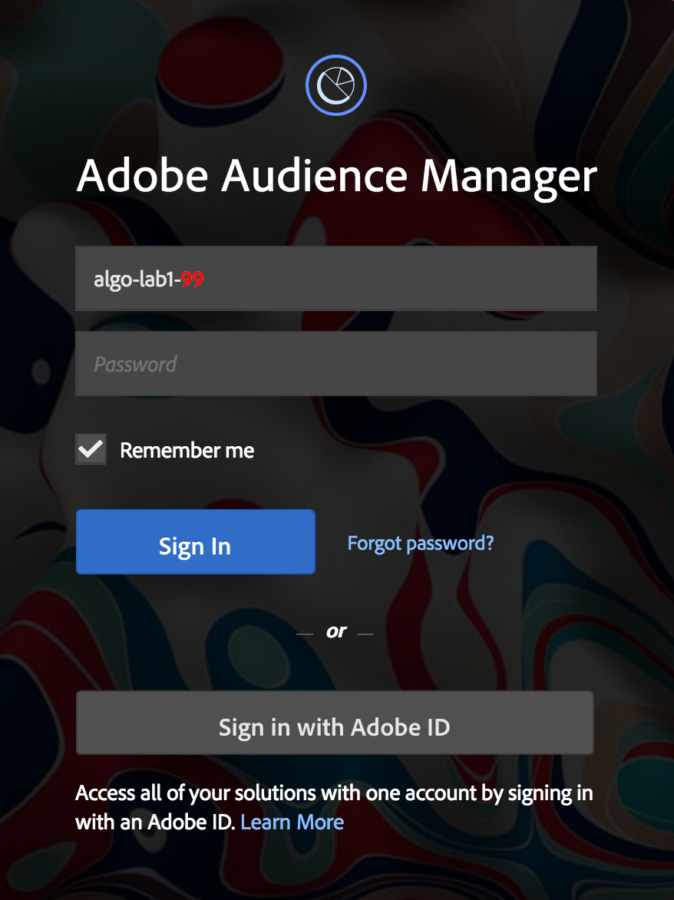</div>

---

<h1>Exercise 1: Extend Sold Out Inventory From Your 1st Party Data</h1>

<div align="center"></div>

You are the Ad Sales Manager at **AutoCentral** - a popular automotive review and shopping web site. You have a **Mini Cooper enthusiasts** segment audience of 5K users which has sold out and you want to extend this audience with other Mini Cooper look-alike users from your 1st party data.

---

<h2>[Step 1]: Build a model with 1st party data sources</h2>

<div align="center">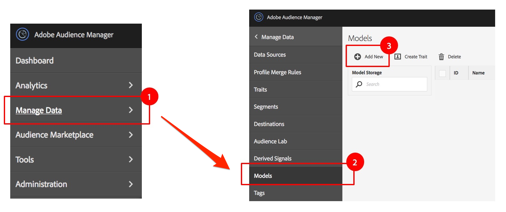</div>
<br>
<div align="center">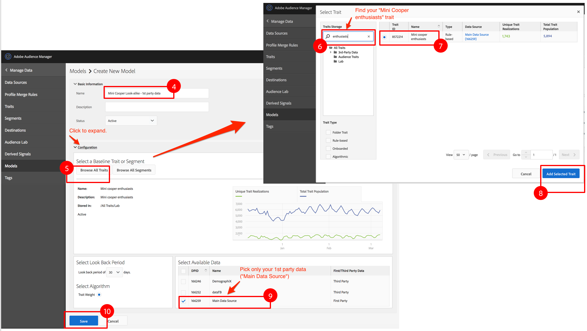</div>

1. Click *Manage Data*
2. Click *Models*
3. Click *Add New*
4. Name the new model *Mini Cooper Look-alike - 1st party data*
5. Click *Browse All Traits*
6. Search for *enthusiasts*
7. Pick *Mini cooper enthusiasts*
8. Click *Add Selected Trait*

---

<h1>Spotlight</h1>

- Congratulations! You have just created your first look-alike model. Now you can grab a cup of coffee. Results will be ready within 24hr.
- Luckily, we have already pre-run the exact same models in each of your accounts, so you don't have to wait.

---

<h2>[Step 2]: Understand and analyze model results</h2>

To view and analyze the model results, open the **[PREGENERATED] Mini Cooper look-alike - 1st party data** model.

<div align="center">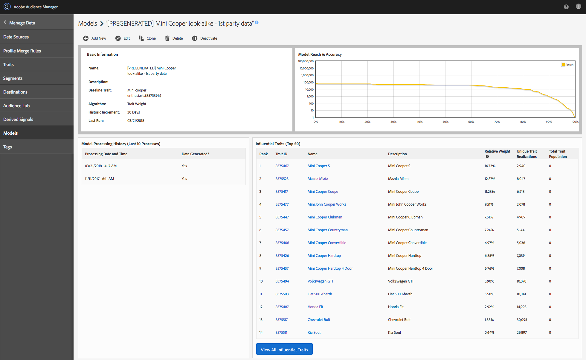</div>

---

<h1>Spotlight</h1>

- We can see that the model generated a nice curve for the **Accuracy & Reach** graph.
- This graph gives you a sense of how many look-alike users were found at different accuracy (similarity) levels. 
- The more users you want to reach, the less similar they will be to your baseline.
- The list of **Influential Traits** gives you a sense of the model learnings. These are traits that the model discovered to be highly correlated to the baseline. Our algorithm (TraitWeight) gives importance to traits that are very common to the baseline audience, but at the same time are very specific to the baseline (rare in the overall pool of users outside the baseline).
- Once the model computes the list of influential traits and assigns weights to them, it calculates a score for each user outside the baseline by adding the weights of the traits that this user has.
- In this exercise, we showcased how a publisher can model against their 1st party data. Publishers, however, often use 2nd and and 3rd party data in look-alike modeling as well:
  - As input to the model in order to further "refine" the baseline (e.g. construct a baseline = 1st party trait + 3rd party demographics data)
  - As Data Sources to model against in order to gain insights about the baseline audience and describe it before selling.

_Note: We have generated synthetic data in each of your accounts, so the reach you see may be low. In reality, you will be able to see Accuracy & Reach graphs that go up to 25MM._

---

<h1>Exercise 2: Discover Look-Alike Users From 2nd and 3rd Party Data</h1>

Congratulations! You have just been able to expand the reach of your original **Mini Cooper enthusiasts** audience with brand new look-alikes at no cost from your own 1st party data. You can sell this audience and turn in great profit.

Now let's also see how your colleague, the Digital Marketing Manager at **AutoCentral**, can leverage Audience Manager's look-alike modeling. Her goal is to broaden the **Mini Cooper enthusiasts** audience and target these new users on other sites. Creating a look-alike model against your 1st party data is great, but the pool of new users that she will be able to reach will hit its limit eventually. 

The real power of Audience Manager's Look-alike Modeling comes when you seek to expand your baseline audience against a quality, brand new set of users from 2nd and 3rd party data source. To make it easy to get that data, Audience Manager provides you with the [**Audience Marketplace**](https://marketing.adobe.com/resources/help/en_US/aam/c_audience_marketplace.html) feature. In Audience Marketplace, data sellers list their data feeds and you can choose which you'd like to use by subscribing. Reporting tools let you track feed usage and the overlap between your traits and those in a subscribed data feed. 

Now let's see how we can choose 3rd party data and use it for modeling.

---

<h2>[Step 1]: Navigate to Audience Marketplace and browse around</h2>

<div align="center">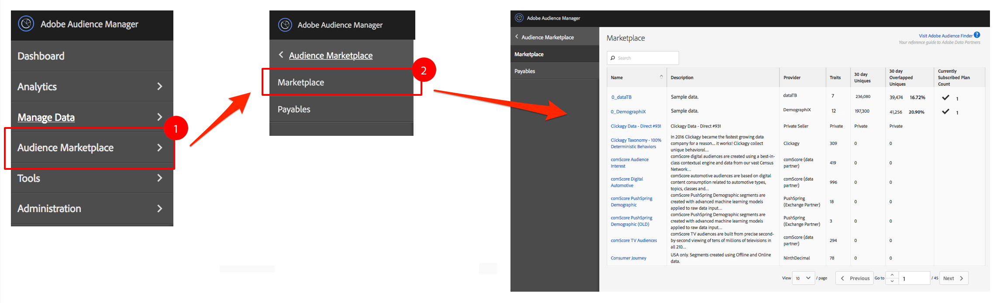</div>

You may need to click on *< Manage Data* to get back to the main navigation. 
1. Click on *Audience Marketplace*
2. Click *Marketplace*

---

<h2>[Step 2]: Subscribe to 3rd party data sources in Audience Marketplace</h2>

For this exercise, we will work with two particular data feeds: **DemographiX** and **dataTB**. Your accounts have already been subscribed to them.

<div align="center">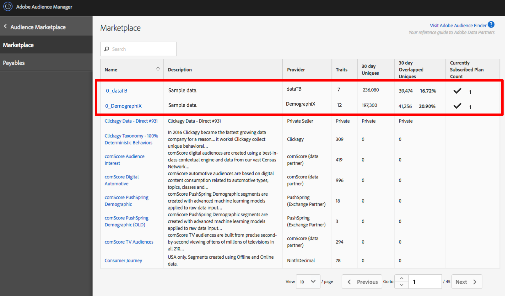</div><br>

_Note: Since this is a beta environment, you can "subscribe" for as many feeds as you wish at no cost._

---

There are so many feeds! When searching to subscribe to a 3rd party data feed, however, which one should I choose? 

The **Audience Marketplace** stats for each data feed come in handy. Consider data feeds, which have a good number of unique users, and at least some overlap with your data (so your algo model can run successfully). Overlap & unique user counts are calculated for free, but you need to explicitly subscribe for **Segments & Overlap** (option available once you click on individual data feeds).

<div align="center">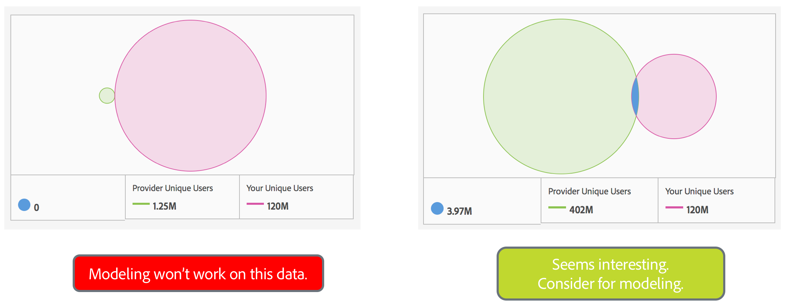</div>

---

Feeds can be billed at a flat rate or by CPM. If the feed uses CPM pricing, you can enable Modeling at no cost, but once you decide to activate the data, you will need to pay according to your usage.

<div align="center">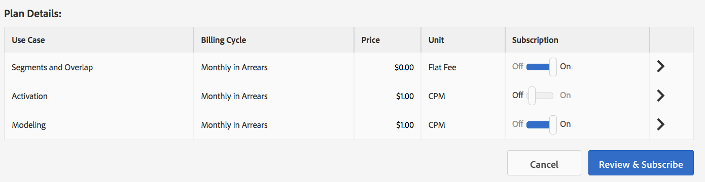</div><br>


If the feed uses Flat Fee pricing, that will be the monthly cost that you need to pay.

<div align="center">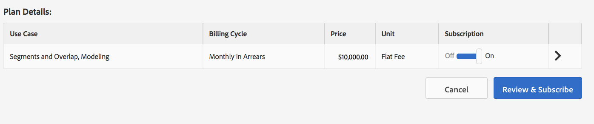</div>

---

<h2>[Step 3]: Build two models: same baseline, different 3rd party data sources</h2>

Now let's build two new algo models exactly as you did in [Exercise 1](#exercise-1-extend-sold-out-inventory-from-your-1st-party-data) (same **Mini cooper enthusiasts** baseline), but in **Select Data** pick each of the two 3rd party data sources and create two models. 

By creating two separate models with two different data sources, you can compare the resulting models. Then you could decide which data feed is better suited for extending your audience and choose to only purchase that data feed going forward. 

Since it takes a few hours for models to run and produce results, we have built and run exactly the same models for you. Take a look at the **[PREGENERATED]** model results produced with 3rd party data from **dataTB** and **DemographiX**:

<div align="center">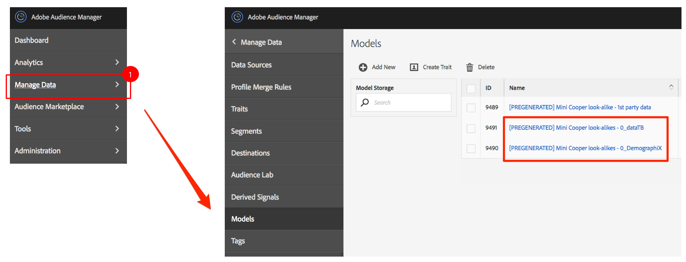</div>

---

<h1>Spotlight</h1>

- The Digital Marketing Manager at AutoCentral is able to analyze the output of the two models built with different 3rd party data sources.
- She is able to gain valuable insights about the **Mini Cooper enthusiasts** based on the list of Influential Traits displayed from each model. One of the models surfaces traits such as students, young demographic, etc. The other one surfaces that the baseline users are also frequent IKEA and Online Book Shoppers. 
- The Digital Marketing Manager can now expand the reach of AutoCentral's campaign. She can build look-alike audiences and target them across various web sites.

---

<h1>Exercise 3: Measure Performance From Different Models via Audience Lab</h1>

Now that you have been able to build various models with your own data and with various 3rd party data, let's see how we can measure which models and data providers give you the best outcome. Analyzing the model results may give you some insights, but the best way to measure model performance is by running an active online test.

For this exercise, we will use an Audience Manager native feature called [**Audience Lab**](https://marketing.adobe.com/resources/help/en_US/aam/audience-lab.html).

**Audience Lab** allows customers to run A/B testing on their segments against DSPs of their choice in order to measure performance (Click Through Rate - CTR). In our case, we want to measure the performance of the audiences created by each of the 3rd party data look-alike models that we just built. 

<h2>[Step 1]: Create algorithmic traits</h2>

First, we need to create two algorithmic traits from each of the **[PREGENERATED]** 3rd party data models (**dataTB** and **DemographiX**). Pick a similar reach when creating the algo traits (e.g. ~30,000 users).

<div align="center">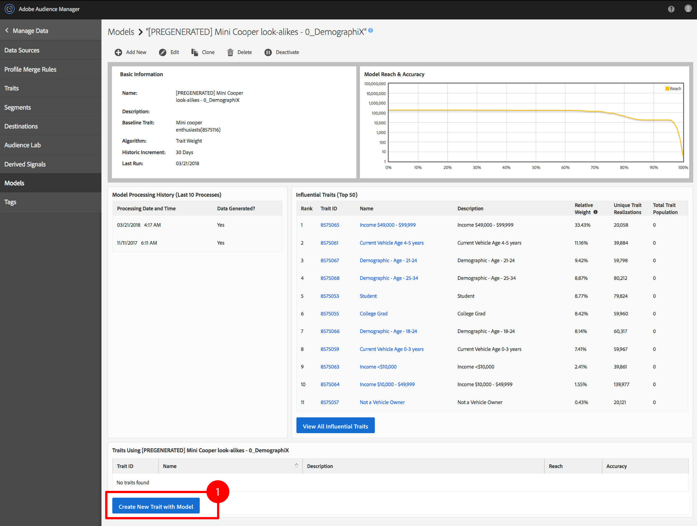</div>
<br>
<div align="center">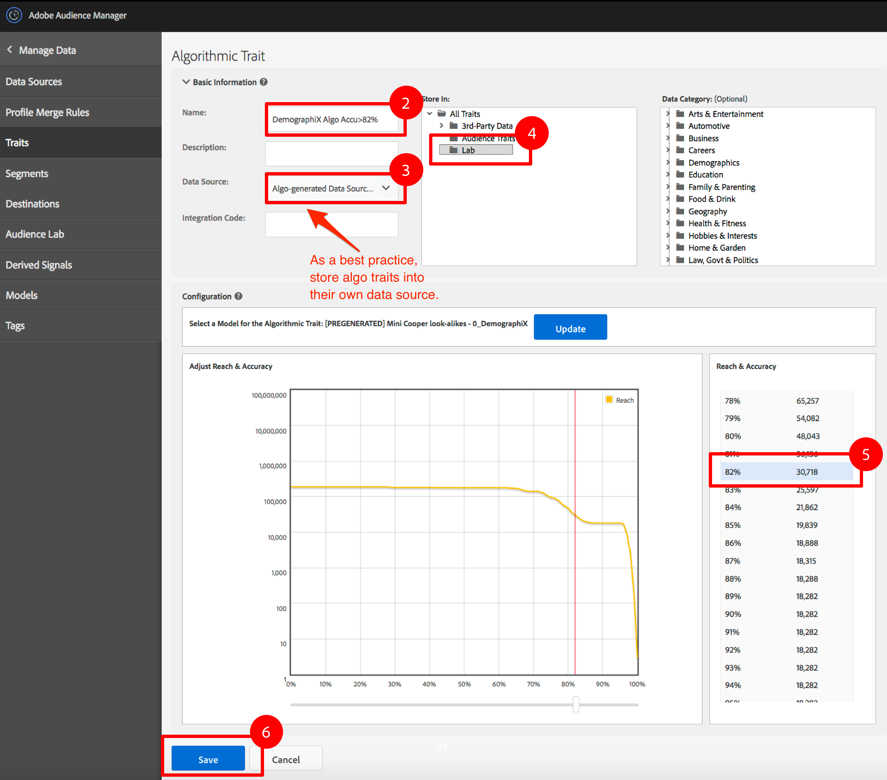</div><br>

1. Scroll down to the bottom of the Model Results page. Click *Create New Trait with Model*
2. Name the trait *DemographiX Algo Accu>82%*
3. Select *Algo-generated Data Source* as the Data Source
4. Pick the *Lab* folder to store the new trait
5. Select 82% Accuracy 
6. Click *Save*

_Note: Remember to repeat the above steps for **dataTB**._

---

<h2>[Step 2]: Create segments with the algorithmic traits</h2>

In order to use **Audience Lab** and test effectiveness of the models, you will first need to map each of the newly-generated algorithmic traits from [Exercise 2](#exercise-2-discover-look-alike-users-from-2nd-and-3rd-party-data) into their own segments.

<div align="center">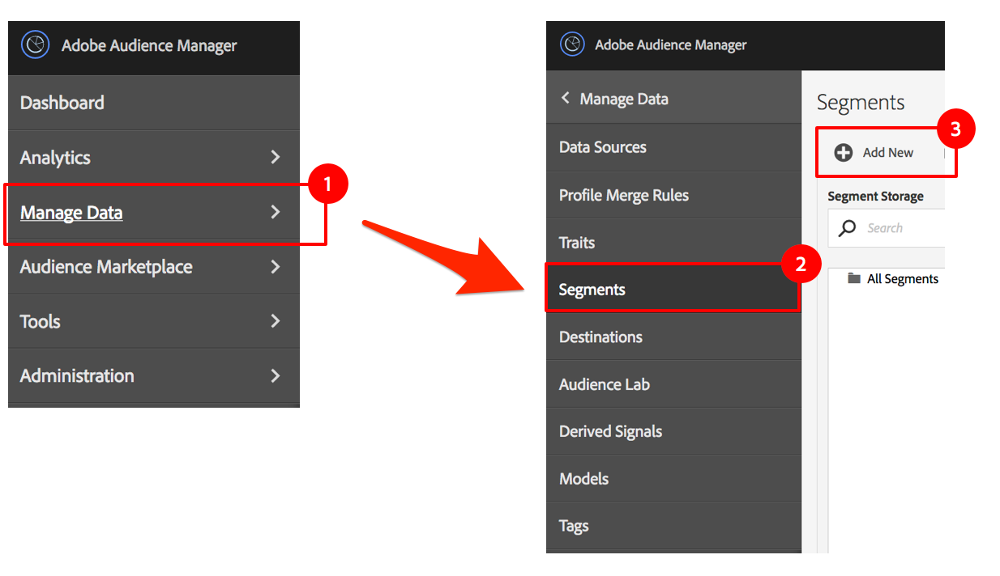</div>
<br>
<div align="center">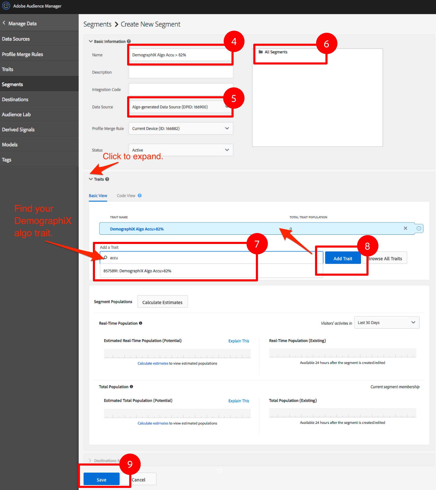</div><br>

1. Click *Manage Data* (if necessary)
2. Click *Segments*
3. Click *Add New* to start creating a new segment
4. Name the new segment *DemographiX Algo Accu>82%*
5. Select *Algo-generated Data Source* as the Data Source
6. Store the segment in the *All Segments* folder
7. Search for the trait you created in Step 1
8. Once you've found the trait, click *Add Trait*
9. Save

_Note: Remember to repeat the above steps for **dataTB**._

---

<h2>[Step 3]: Create a conversion trait</h2>

You will also need a conversion trait in order to collect CTR information from your Audience Lab tests and measure performance. A conversion trait is one that tracks valuable site actions such as product purchases and cart additions. For this lab, we'll stick to using **[PREGENERATED] Conversion Trait** and skip directly to the [NEXT STEP](#step-4-create-two-audience-lab-tests-to-measure-click-through-rate). If you are interested in how a conversion trait is configured, please feel free to examine **[PREGENERATED] Conversion Trait** in the Traits page.

---

<h2>[Step 4]: Create two Audience Lab tests to measure click through rate</h2>

Next, let's set up two **Audience Lab** tests in order to measure efficacy of your 3rd party data look-alike models. Follow the steps below to set up a test group for the **DemographiX** algo segment, then repeat the same steps and set up one more test group for the **dataTB** segment.

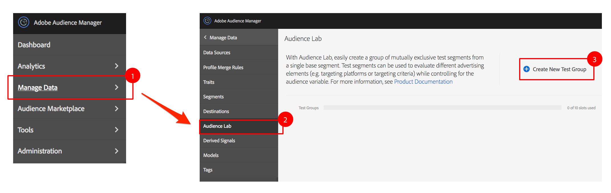
1. Click *Manage Data*
2. Click *Audience Lab*
3. Click *Create New Test Group*

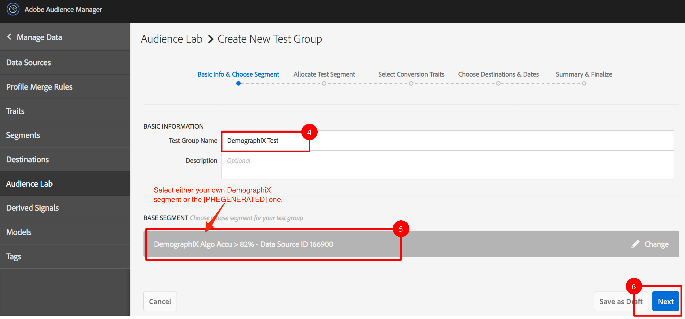
4. Name the Test Group *DemographiX Test*<br>
5. Click *Choose Base Segment* and Select DemographiX segment you just created OR *[PREGENERATED] DemographiX - Accu > 82%*<br>
6. Click Next

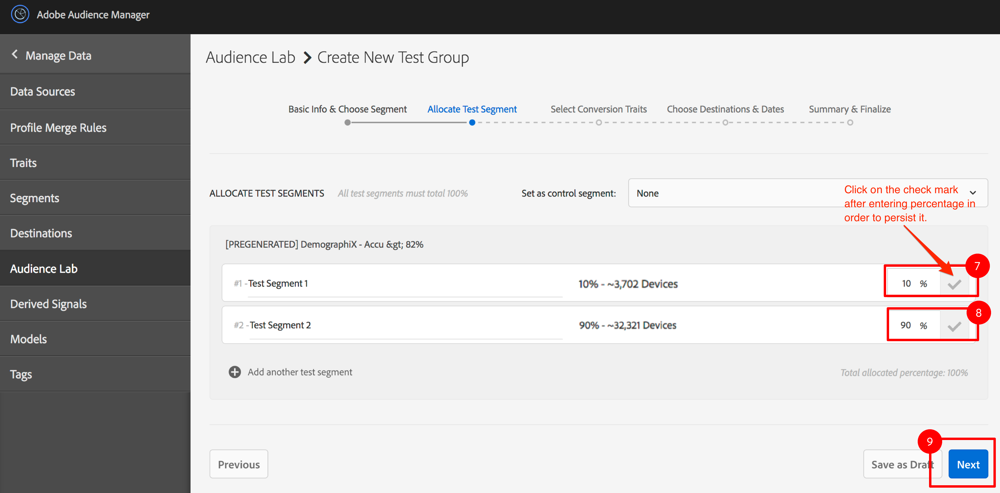
7. For *Test Segment 1*, set the percentage as 10% and make sure to click the blue checkbox<br>
8. For *Test Segment 2*, set the percentage as 90% and make sure to click the blue checkbox<br>
9. Click Next

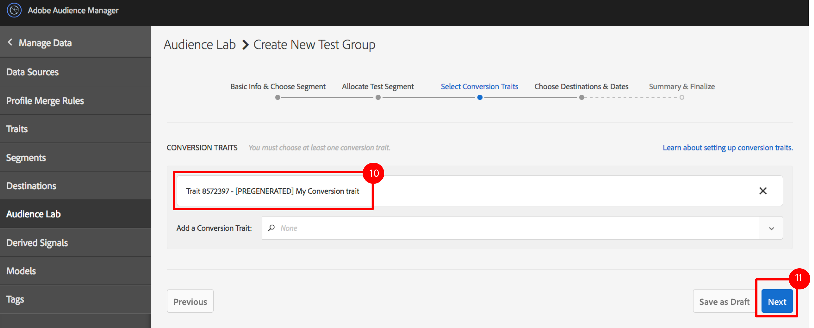
10. Click the drop down on *Add a Conversion Trait* to add *[PREGENERATED] Conversion trait*<br>
11. Save

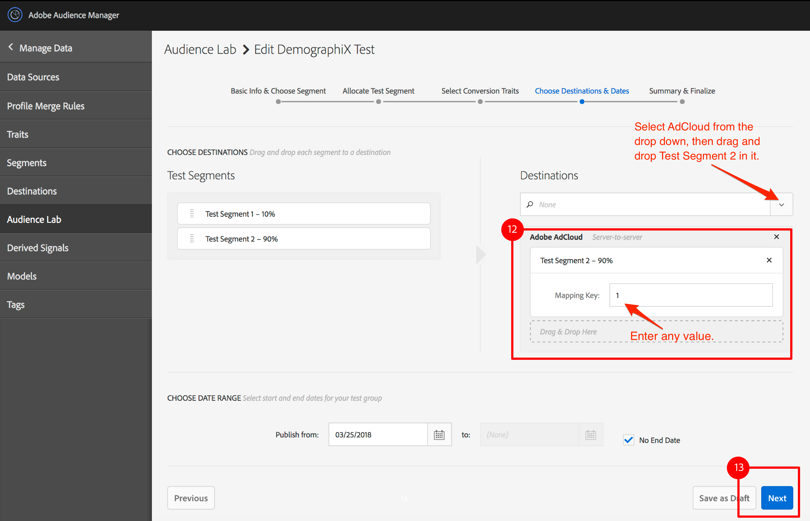
12. Under Destinations, select Ad Cloud from the drop down. Drag and drop *Test Segment 2* to it. Enter *1* as the mapping value. <br>
13. Click *Next*

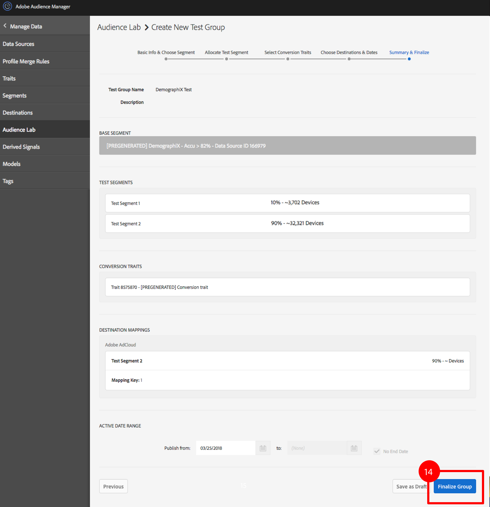
14. Click *Finalize Group*

---

<h1>Spotlight</h1>

- You have just created two Audience Lab tests in order to determine which 3rd party data performs better. 
- The **DemographiX** and **dataTB** algo audiences (**Test Segment 2**) will be sent to the same destination (AdCloud), so you can construct a valid comparison.
- Because you are comparing click through _rates_ and not actual conversion counts, even if your algo audiences have slightly different sizes, that's ok. 
- We used **Test Segment 1** for withholding some of the data. If you have a large audience and you don't want to send all of it to the destination, you can use it to retain a percentage of the data. We have chosen to withhold 10% of the data, but you can pick a number that you deem appropriate.
- Your active tests will now start collecting data and in a few days, you will be able to analyze the performance of your models and decide which of the 3rd party data sources gives you the best ROI.
- We have already run the same tests for you, so switch to the **[PREGENERATED]** tests to review results.
- We can immediately spot that the **DataTB** model produced much higher CTR than the **DemographiX** one.

<div align="center">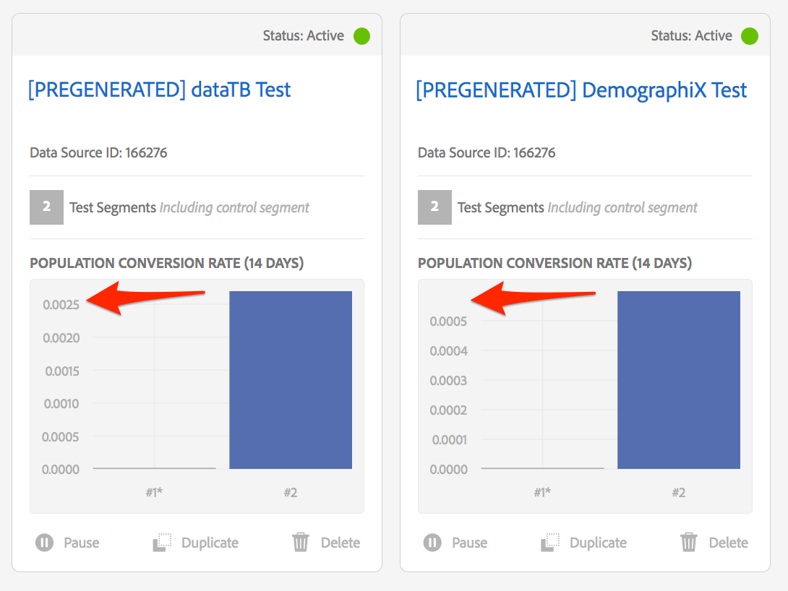</div><br>

- Aggregate and Trend Reporting on conversion rates and total conversions are also available as you open each test.
<div align="center">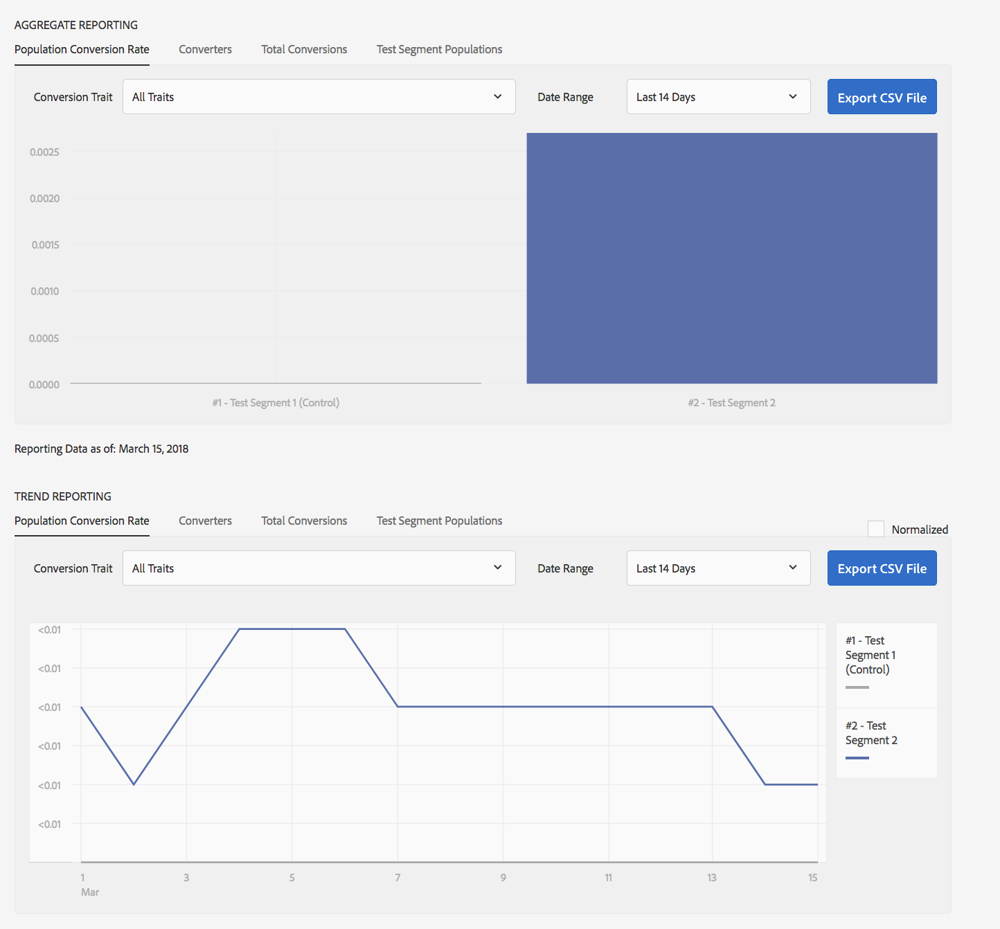</div>

---

<h1>Exercise 4 (Extra Credit): Measure Performance From a Single Model at Different Accuracy Levels</h1>

Now that you have learned all the key components for building look-alike models and measuring results, can you try to design a test that measures CTR at different accuracy bands from one of your models? 

For example, let's try to measure the performance for three groups of look-alike users:
```
HIGHEST value = accuracy [95-100]%
MEDIUM value  = accuracy [90-95]%
LOWEST value  = accuracy [80-90]%
```

_Hint: Create mutually-exclusive buckets at segment level._

<div align="center">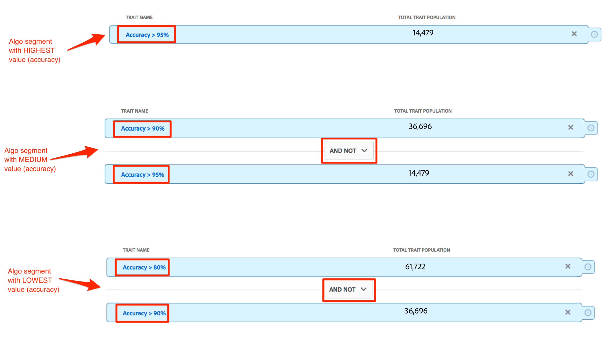</div>

---

<h1>Spotlight</h1>

- Creating mutually-exclusive buckets at segment level can be useful not only for measuring model performance at different accuracy bands, but also when you want to vary user experience or bid based on accuracy score.
- You can even set up one more test group to compare performance against your baseline.

---

<h1>Common Mistakes And Troubleshooting Tips</h1>
<h2>FAQ</h2>

* **Q:** I am getting a flat Accuracy & Reach graph. Why?
* **A:** A flat Accuracy & Reach graph means that almost every user received the same score by the model. A very likely reason for this to happen is that you included some site visitor trait in the data sources that you modeled with. Remove this generic trait from the model input by separating it into its own data source.

---

* **Q:** I see that some of the top influential traits have very small audiences. Why?
* **A:** The algorithm selects traits that are highly correlated with the baseline trait, from the perspective of that trait. For example, if a given trait has 100% overlap with the baseline trait, it will have a very high weight, even if the number of users in that trait is small.

---

* **Q:** Why hasn't my model run/rerun?
* **A:** Models that have produced results will continue to run only if you have created at least one active algo trait and mapped it to an active segment and a destination.
 
---

* **Q:** Why didn't my model produce any results?
* **A:** This is typically caused by not having significant trait overlaps between the baseline population and population in the data sources selected.

---

* **Q:** Is there any recommendation on the baseline trait/segment size?
* **A:** A few thousand users should be sufficient given that there is significant trait overlaps between the baseline population and population in the data sources selected. Look-alike modeling will be more accurate for bigger baselines, since the statistical relationships will be stronger.

---

* **Q:** What 3rd party data sources should I pick to model against?
* **A:** Select data sources that have at least some overlap with your baseline trait/segment, but at the same time bring in additional users. Also, consider the cost associated with each data feed. Cost and pricing models vary among data providers in Audience Marketplace.

---

* **Q:** Does it cost to use 3rd party data for modeling?
* **A:** It depends on the pricing model of the data feed. Some feeds allow modeling at no cost, while others allow it at a fee.

---

* **Q:** How many models/traits am I allowed to create?
* **A:** At the moment, companies have a limit of 20 algo models and 50 algo traits.

---

* **Q:** How often does the model retraining and algo trait population refresh happen?
* **A:** Once every 8 days.

---

<h2>Tips & Gotchas</h2>

* For best results, use highly specific baseline trait as a start. If you start modeling from a baseline trait, which is very generic, you will derive "generic" results.
* Build granular trait taxonomy.
* Select short lookback period - 30 days.
* As a best practice, create a new data source to store your algo traits and segments in. Do not use algo traits as baselines and do not include them with your data sources for modeling.
* Exclude generic traits such as site visitor traits into a separate data source.

---

<h1>BONUS: Use Audience Manager’s API to Create Traits, Segments, and Models.</h1>

Here is a bonus script that you could use in the future should you decide to automate the creation of traits, segments, and models for your account via [Audience Manager's APIs](https://marketing.adobe.com/resources/help/en_US/aam/c_rest_api_main.html).

[Provisioning script for the summit test site](https://github.com/iulian-radu/Summit2018/tree/master/L757/script/)

---


